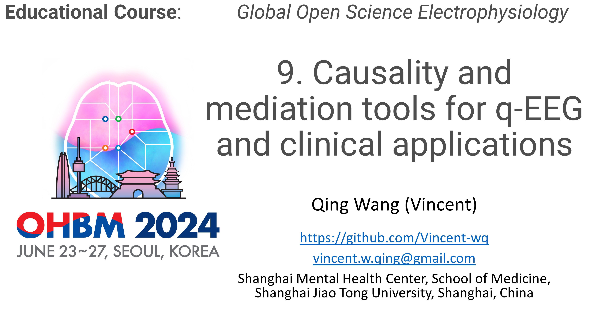
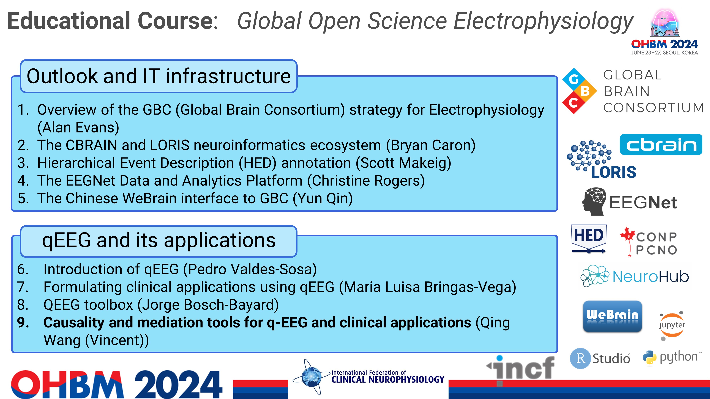

# causal_course_eeg  

The course materials for ohbm 2024 educational courses Global Open Science Electrophysiology-Causal inference in clinical neuroscience with open science EEG.

## Welcome to this causal turorial!

## Shedule for this Global Open Science Electrophysiology tutorial (full day)

